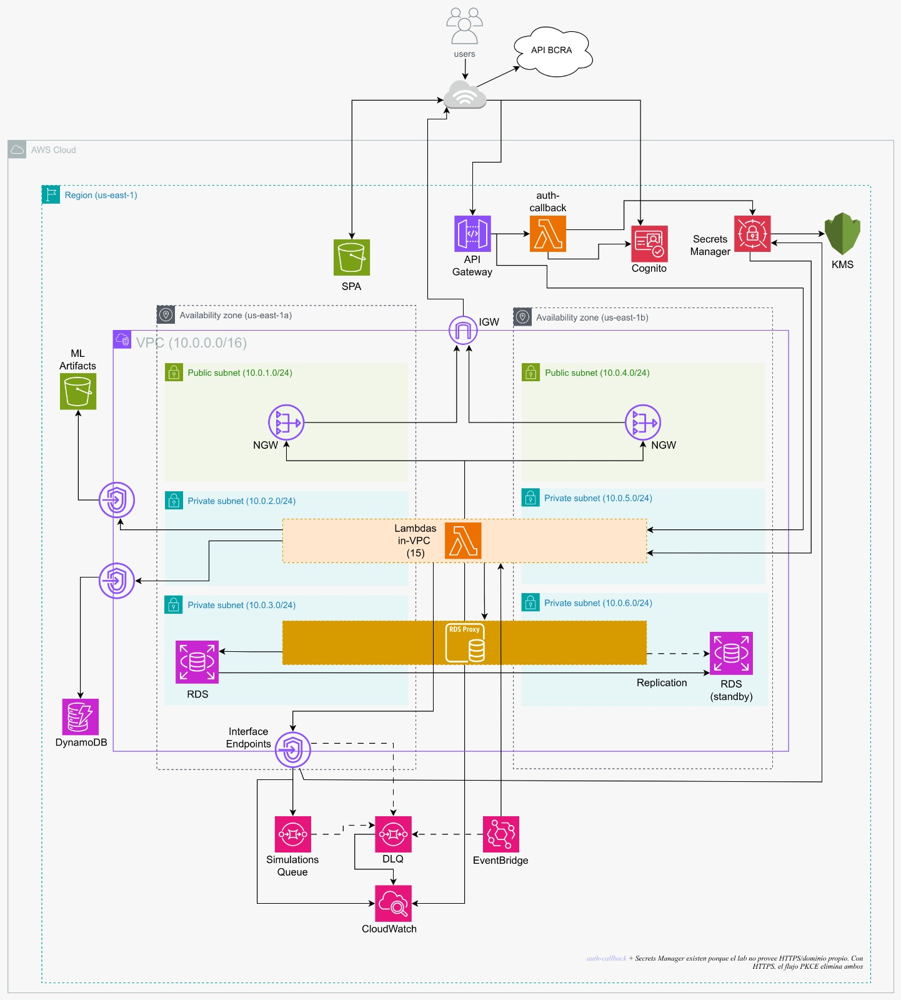

# Presti - Cloud Computing

El presente trabajo, realizado para la materia _Cloud Computing_, consiste en el desarrollo una motor de decisiones para Fintechs que busca mejorar el otorgamiento de productos crediticios (préstamos) a sus clientes minoristas. Para esto, se desarrolló una plataforma cloud que contiene un motor de machine learning que consulta los datos históricos de la _Central de Deudores del BCRA_ y predice la situación creditica por los próximos meses.

La plataforma cuenta principalmente con las siguientes funcionalidades representadas en su panel de control:

- <b>Carga y Gestión de Productos</b>: Panel administrativo para que la Fintech gestione de forma directa su catálogo de ofertas financieras (préstmos de distintos montos, plazos, etc.) y les asigne prioridades según sus preferencias comerciales.

- <b>Motor de Simulaciones</b>: Módulo para calcular en tiempo real el scoring de nuevos clientes ingresando su CUIT. Consulta información del BCRA, evalúa al deudor a través de un modelo de Deep Learning (MLP con TensorFlow/Keras) y ofrece recomendaciones inteligentes e instantáneas de productos elegibles.

- <b>Configuración de Parámetros</b>: Sección dedicada a definir los parámetros y reglas globales del negocio de la Fintech (como los umbrales de score mínimo y criterios generales de exclusión) para filtrar automáticamente a solicitantes de alto riesgo.

- <b>Control de Cartera</b>: Monitoreo continuo y centralizado del estado crediticio e historial de deudas de los CUITs en cartera. Permite visualizar tendencias de comportamiento de pagos (mejorando, empeorando o estable) y soporta tanto actualizaciones manuales como automáticas programadas (mediante crons mensuales).

- <b>Simulador de Escenarios</b>: Herramienta para proyectar el impacto de modificar los parámetros de elegibilidad sobre la totalidad de la cartera ya evaluada, sin afectar la configuración real. Permite comparar cuántos clientes se aprobarían o rechazarían con los valores actuales frente a los simulados antes de aplicar un cambio.

- <b>API de Integración (B2B)</b>: Endpoints REST para que las Fintech integren la evaluación crediticia en sus propios sistemas, autenticados mediante API keys que se generan y rotan desde el panel.

<details>
  <summary>Contenidos</summary>
  <ol>
    <li><a href="#diagrama-de-arquitectura">Diagrama de Arquitectura</a></li>
    <li><a href="#estructura-del-repositorio">Estructura del Repositorio</a></li>
    <li><a href="#guía-de-instalación-y-despliegue">Guía de Instalación y Despliegue</a></li>
    <li><a href="#uso-de-la-aplicación-guía-de-ejecución">Uso de la Aplicación (Guía de Ejecución)</a></li>
    <li><a href="#descripción-de-módulos">Descripción de Módulos</a></li>
    <li><a href="#explicación-de-funciones-y-meta-argumentos">Explicación de Funciones y Meta-Argumentos</a></li>
    <li><a href="#pipeline-de-github-actions-para-terraform">Pipeline de GitHub Actions (Terraform)</a></li>
    <li><a href="#aclaraciones">Aclaraciones</a></li>
    <li><a href="#integrantes">Integrantes</a></li>
  </ol>
</details>

<p align="right">(<a href="#presti---cloud-computing">Volver</a>)</p>

## Diagrama de Arquitectura



<p align="right">(<a href="#presti---cloud-computing">Volver</a>)</p>

## Estructura del Repositorio:

```
cloud-presti/
├── frontend/               # SPA React + Vite (dashboard fintech)
├── engine/                 # Pipeline Python de training del modelo crediticio
├── backend/                # 20 Lambdas (19 Node.js + 1 Python para el engine de simulaciones)
├── terraform/              # Stack principal de infra (root module)
│   └── modules/
│       └── network/        # Módulo interno de VPC + subnets + RTs + SGs + endpoints
├── terraform-bootstrap/    # Stack independiente para el state remoto (run una vez)
├── scripts/                # Helpers: bootstrap, deploy, build-engine, build-frontend...
└── .github/
    └── workflows/          # CI (validate) + apply / destroy / bootstrap manuales
```

<p align="right">(<a href="#presti---cloud-computing">Volver</a>)</p>

## Guía de Instalación y Despliegue

Este proyecto está completamente automatizado para ser desplegado y gestionado utilizando **GitHub Actions**. Se deben seguir los siguientes pasos para configurar el repositorio y levantar la infraestructura en AWS:

### Paso 1: Configurar Secretos y Variables en GitHub

Antes de ejecutar cualquier pipeline, se requiere definir los accesos a AWS y el espacio de nombres del stack en la configuración del repositorio de GitHub:

1. Ingresar a **Settings (Configuración) → Secrets and variables → Actions** dentro del repositorio de GitHub.
2. En la pestaña **Secrets** (Secretos), se deben crear los siguientes secretos:
   - `AWS_ACCESS_KEY_ID`: ID de clave de acceso de AWS.
   - `AWS_SECRET_ACCESS_KEY`: Clave de acceso secreta de AWS.
   - `AWS_SESSION_TOKEN`: Token de sesión temporal (necesario si se utiliza AWS Academy o credenciales temporales).
3. En la pestaña **Variables**, se debe crear la siguiente variable:
   - `STACK_NAME`: Nombre único que identificará al stack (por ejemplo, `cloud-presti`). Todos los recursos aprovisionados (buckets S3, tablas DynamoDB, Cognito User Pool, etc.) utilizarán este valor como prefijo para evitar colisiones.

### Paso 2: Ejecutar el Bootstrap

El Bootstrap se encarga de crear el bucket de S3 y la tabla DynamoDB que almacenarán de forma remota y segura el estado de Terraform (`terraform.tfstate`) y gestionarán el bloqueo de concurrencia.

1. Dirigirse a la pestaña **Actions** en GitHub.
2. En la barra lateral izquierda, seleccionar el workflow **Bootstrap Apply**.
3. Hacer clic en **Run workflow** (Ejecutar workflow) seleccionando la rama `main` y presionar el botón verde para confirmar.
4. Esperar a que el pipeline finalice exitosamente. Esto creará el bucket `${STACK_NAME}-state-bucket` y la tabla DynamoDB `${STACK_NAME}-lock-table`.

### Paso 3: Desplegar la Infraestructura y el Frontend

Una vez completado el bootstrap, se puede proceder con el aprovisionamiento de la arquitectura principal y el despliegue del panel de control web.

1. En la pestaña **Actions**, seleccionar el workflow **Terraform Apply**.
2. Hacer clic en **Run workflow**, seleccionar la rama `main` y presionar el botón verde.
3. Este pipeline ejecutará de forma automática los siguientes pasos secuenciales:
   - **Instalación de dependencias**: Se descargan en paralelo las dependencias de todas las Lambdas Node, se copia el módulo compartido (`shared/enqueue.js`) y se compila el engine de Python.
   - **Validación y Plan de Terraform**: Se genera y valida de forma estricta el plan de ejecución de infraestructura.
   - **Terraform Apply**: Se aprovisionan de forma segura todos los recursos en la nube de AWS (red VPC, DynamoDB, RDS PostgreSQL con RDS Proxy, Secrets Manager, Lambdas, SQS, API Gateway, Cognito).
   - **Migraciones de Base de Datos**: Se invoca la Lambda `db-migrations` (vía `scripts/migrate.sh up`) para aplicar las migraciones de `node-pg-migrate` y dejar el esquema de PostgreSQL al día.
   - **Compilación del Frontend**: Se inyectan dinámicamente las variables de entorno producidas por Terraform (como el endpoint de API Gateway y el ID de cliente de Cognito) en un archivo `.env.production` en React.
   - **Despliegue Web**: Se compila la SPA de React y se sincronizan los archivos construidos con el bucket S3 de hosting web.
4. Al finalizar, en la salida del workflow o en los outputs de Terraform se podrán encontrar el endpoint de API Gateway y la URL pública de la aplicación para comenzar con su utilización.

---

### Mantenimiento y Destrucción del Stack (Opcional)

En caso de requerir la limpieza y eliminación completa de toda la infraestructura creada para evitar costos continuos:

1. En la pestaña **Actions**, seleccionar el workflow **Terraform Destroy**.
2. Hacer clic en **Run workflow**.
3. En el campo de confirmación requerido, escribir exactamente la palabra `destroy`.
4. Presionar el botón verde de ejecución. El pipeline vaciará de manera segura el bucket S3 del frontend y destruirá absolutamente todos los recursos de AWS asociados al stack.

<p align="right">(<a href="#presti---cloud-computing">Volver</a>)</p>

## Uso de la Aplicación (Guía de Ejecución)

A continuación se detalla la guía paso a paso para la ejecución de los flujos de negocio clave desde la perspectiva del usuario de la plataforma:

### 1. Registro y Autenticación

1. **Acceso al Portal**: Al ingresar a la URL pública de la aplicación, el usuario selecciona la opción de registrarse para crear una nueva cuenta.
2. **Formulario de Registro**: Es redirigido de forma segura a la pantalla de registro, donde se solicita ingresar una contraseña segura que cumpla con los estándares requeridos (mayúsculas, minúsculas, números y longitud mínima).
3. **Confirmación**: Se envía de manera automática un código de confirmación a la dirección de correo electrónico provista.
4. **Validación de la Cuenta**: Al ingresar el código recibido, la cuenta queda activa y configurada de forma inmediata con los parámetros generales y reglas de negocio por defecto para la Fintech.
5. **Onboarding**: La primera vez que ingresa, se solicita el nombre de la Fintech. Hasta completarlo, el usuario es redirigido a la pantalla de onboarding antes de poder acceder al resto del panel.

### 2. Configuración de Parámetros Generales

Desde la pestaña **Parámetros**, la Fintech establece las reglas de exclusión automática que se evaluarán para cada solicitante antes de procesar el modelo de Machine Learning.

- **Parámetros configurables**:
  - **Situación Crediticia Máxima**: Calificación máxima admitida en las centrales de deudores (por defecto, situación 2).
  - **Límite de Entidades Financieras**: Cantidad máxima permitida de acreedores con deudas vigentes.
  - **Deuda Máxima Permitida**: Límite total en pesos del monto consolidado de deudas del solicitante.
  - **Historial Limpio Requerido**: Cantidad de meses mínimos consecutivos que se le exige al cliente estar en excelente situación de pago (Situación 1).
  - **Días de Atraso Máximos**: Tolerancia máxima en días para atrasos en sus pagos vigentes.
  - **Procesos Judiciales**: Exclusión automática si el solicitante posee algún proceso legal o juicio financiero activo.
- **Aplicación de Cambios**: Cualquier cambio realizado en esta sección se guarda al instante y comenzará a aplicar para las evaluaciones futuras.

### 3. Alta de Productos Financieros

Para poder generar recomendaciones inteligentes, la Fintech debe construir su catálogo de ofertas disponibles. Desde la sección **Productos → Nuevo producto**, se configuran los siguientes campos:

- **Detalle del Producto**: Nombre descriptivo, Monto, Plazo (cantidad de cuotas), Tasa de interés anual y Prioridad comercial (peso de 1 a 10 para ponderar su visualización ante el cliente).
- **Restricción de Scoring**: Rango de score de elegibilidad (en escala de 0.0 a 10.0) que se le exige al solicitante para calificar a esta oferta.
- **Catálogo Activo**: Al crearse, el producto queda disponible para ser recomendado dinámicamente si el solicitante cumple con la puntuación requerida.

### 4. Ejecución de una Simulación

Para evaluar el riesgo crediticio de un nuevo cliente y recibir recomendaciones en tiempo real:

1. **Iniciar Evaluación**: En la sección **Simulaciones → Nueva simulación**, el usuario introduce el CUIT del solicitante.
2. **Evaluación de Filtros**: El sistema consulta automáticamente el historial crediticio del CUIT en la central de deudores y aplica los filtros definidos en la _Configuración de Parámetros_. Si no los cumple, la simulación se marca como **Rechazada** (especificando con precisión qué regla de negocio falló).
3. **Cálculo de Score**: Si supera exitosamente los filtros de exclusión, un modelo de inteligencia artificial de última generación analiza el perfil crediticio para determinar un puntaje de riesgo preciso.
4. **Estados del Proceso**:
   - _En proceso_: Analizando los antecedentes financieros y corriendo filtros.
   - _Completada_: Simulación finalizada con éxito con un score y recomendaciones calculadas.
   - _Rechazada_: Evaluada pero descartada por incumplir alguna política comercial.

### 5. Consulta de Recomendaciones

Cuando la simulación finaliza con estado **Completada**, el usuario puede ingresar al detalle para visualizar el análisis completo:

1. **Score Obtenido**: Se expone el puntaje final del solicitante (escala de 0.0 a 10.0).
2. **Ofertas Personalizadas**:
   - **Productos Elegibles**: Lista de los créditos para los cuales el cliente califica según su puntaje de riesgo, ordenados de forma descendente por la prioridad comercial de la Fintech.
   - **Productos No Elegibles**: Aquellos productos que no cumplen con los límites de score del deudor, especificando el motivo del descarte (si está por debajo o por encima del score requerido).

### 6. Control y Monitoreo de Cartera (Portfolio)

La sección de **Cartera** sirve como un centro de control unificado del comportamiento de pago de todos los clientes que han sido evaluados históricamente por la Fintech:

- **Vista General**: Muestra el listado de CUITs consultados junto con su situación crediticia actual, su estado histórico anterior y una clara tendencia visual de comportamiento financiero (si está mejorando, empeorando o se mantiene estable).
- **Actualización Periódica**: La información crediticia de la cartera se actualiza automáticamente todos los meses de forma programada y transparente.
- **Actualización Bajo Demanda**: El usuario puede presionar el botón "Actualizar cartera" en el dashboard para forzar una sincronización manual e inmediata de todos los registros de deudores con el fin de ver reflejados los datos actualizados al instante.

### 7. Simulador de Escenarios

Desde la pestaña **Escenarios**, la Fintech puede medir el impacto de cambiar sus criterios de elegibilidad sobre toda la cartera ya evaluada, sin tocar la configuración real ni volver a consultar el BCRA:

- **Parámetros Ajustables**: Se modifican mediante controles deslizantes los mismos seis criterios de la _Configuración de Parámetros_ (situación crediticia máxima, límite de entidades, deuda máxima, meses mínimos en situación 1, días de atraso máximos y procesos judiciales).
- **Comparativa Inmediata**: El sistema recorre la cartera en PostgreSQL y devuelve cuántos clientes se aprobarían con la configuración actual frente a la simulada, los nuevos elegibles y los nuevos rechazados.
- **Análisis Visual**: Se muestran gráficos de tasa de aprobación, desglose de los motivos de rechazo, distribución de scores, deuda elegible y un perfil general de la cartera, para tomar decisiones informadas antes de aplicar un cambio.

### 8. Integración vía API (B2B)

Desde la pestaña **Integración**, la Fintech gestiona el acceso programático a la plataforma para integrar la evaluación crediticia en sus propios sistemas:

- **Generación de Credenciales**: Se genera una API key con el formato `presti_live_...`. La clave completa se muestra **una única vez** al crearse; el sistema solo almacena su hash SHA256, nunca el valor en claro. Generar una nueva clave rota y desactiva automáticamente la anterior.
- **Documentación Integrada**: El panel incluye ejemplos de uso (con `curl`) de los dos endpoints públicos, autenticados con el encabezado `Authorization: Bearer presti_live_...`:
  - **`POST /v1/evaluations`**: Encola una evaluación enviando el CUIT del solicitante y devuelve un `task_id` con estado `PROCESSING`.
  - **`GET /v1/evaluations`**: Consulta el resultado de una evaluación (por `task_id` o por CUIT) y, si está completada, devuelve el score y los productos recomendados.

<p align="right">(<a href="#presti---cloud-computing">Volver</a>)</p>

## Descripción de Módulos

El proyecto está diseñado bajo un enfoque modular, utilizando **módulos** (contenedores reutilizables de configuraciones de Terraform) para encapsular y reutilizar componentes clave de la infraestructura de manera limpia y escalable:

### 1. Módulo Interno de Red (`terraform/modules/network/`)

Módulo local reutilizable que encapsula el aprovisionamiento de la VPC y el plano de red seguro:

- **Entradas Declarativas**: Recibe configuraciones en variables de tipo objeto (`vpc_config`, `subnets_config`, `route_tables_config`, `security_groups_config`, `vpc_endpoints_config`).
- **Aislamiento**: Crea tres capas de subnets distribuidas en dos Zonas de Disponibilidad: públicas (para NAT Gateways e Internet Gateway), privadas para las Lambdas en VPC y un set privado dedicado a la base de datos RDS, sin ruta a internet para mantenerla completamente aislada.
- **Seguridad y Endpoints**: Implementa Security Groups con soporte para referencias cruzadas (por ejemplo, permitir tráfico únicamente del Security Group de Lambdas hacia los VPC Interface Endpoints, o habilitar el puerto 5432 de PostgreSQL desde las Lambdas hacia el Security Group de RDS).
- **VPC Endpoints**: Crea endpoints de tipo **Gateway** para S3 y DynamoDB (evitando el tráfico a través de internet) y de tipo **Interface** para SQS, CloudWatch Logs, Secrets Manager y KMS en las subnets privadas.

### 2. Módulo Público de DynamoDB (`terraform-aws-modules/dynamodb-table/aws` v4.4.0)

Módulo del registry oficial instanciado **5 veces** para proveer persistencia aislada a nivel de tabla bajo demanda (`billing_mode = PAY_PER_REQUEST`). La cartera de deudores (`portfolio`) dejó de ser una tabla DynamoDB y se migró a PostgreSQL en RDS (ver _Otros Recursos Destacados_), por lo que ya no se aprovisiona mediante este módulo:

1. **`dynamodb_simulations`** (`${stack_name}-simulations`):
   - Hash key: `sub` | Range key: `sk`.
   - **GSI `task-id-sub-index`**: Indexa `task_id` (Hash) y `sub` (Range). Permite a `recommendations-get` y `simulations-results` buscar directamente por el ID de la tarea de forma sumamente rápida, garantizando aislamiento multi-inquilino.
2. **`dynamodb_fintech`** (`${stack_name}-fintech`):
   - Hash key: `sub` (parámetros globales de la Fintech).
3. **`dynamodb_product`** (`${stack_name}-product`):
   - Hash key: `sub` | Range key: `product_id` (catálogo de créditos de la Fintech).
4. **`dynamodb_user`** (`${stack_name}-user`):
   - Hash key: `sub` | Range key: `cuit` (vínculo entre Fintech y CUITs consultados).
5. **`dynamodb_api_clients`** (`${stack_name}-api-clients`):
   - Hash key: `api_key_id` (credenciales de la API B2B de cada Fintech).
   - **GSI `fintech-sub-index`**: Indexa `fintech_sub` (Hash) para resolver todas las keys de una Fintech. Cada ítem guarda el hash SHA256 de la API key (nunca la key en claro) y un flag `active`, que es justamente lo que valida el authorizer Lambda de la API externa.

<p align="right">(<a href="#presti---cloud-computing">Volver</a>)</p>

## Explicación de Funciones y Meta-Argumentos

El diseño de la infraestructura en Terraform utiliza avanzadas metodologías de programación declarativa y validaciones rigurosas:

### 1. Meta-Argumentos Utilizados

- **`for_each`**: Es el motor de la iteración. Evita la duplicación masiva de código instanciando múltiples recursos dinámicamente. Se utiliza para:
  - Las 19 Lambdas del Core (más la `auth-callback`, definida aparte) y sus configuraciones detalladas.
  - Los 20 grupos de logs en CloudWatch (asegurando el ciclo de vida coordinado con cada función).
  - Las rutas e integraciones de API Gateway (`local.api_routes`, `local.api_integrations`), junto con los permisos de invocación y el mapeo de triggers.
  - La creación modular de las 5 tablas DynamoDB.
  - La definición de subnets, tablas de ruteo, reglas de seguridad y endpoints en el módulo `network`.
  - La asignación de alarmas de CloudWatch para métricas de error.
- **`dynamic`**: Utilizado para inyectar bloques configurativos anidados condicionalmente. En `aws_lambda_function.lambdas`, se aplica en:
  - `vpc_config`: Inyecta la red únicamente a las Lambdas que tienen configurado `in_vpc = true`.
  - `dead_letter_config`: Asocia la DLQ solo a aquellas Lambdas asíncronas registradas para opt-in en `local.lambda_async_dlq_arns`.
- **`lifecycle` y `precondition`**: Bloques para definir políticas de ciclo de vida e invariantes de negocio/arquitectura que detienen tempranamente la ejecución antes de causar inconsistencias en AWS:
  - **En `aws_route`**: Valida que si una ruta apunta a un target `nat`, la tabla de ruteo solo contenga subnets de una única Zona de Disponibilidad (AZ) y que exista un NAT Gateway aprovisionado en dicha AZ.
  - **En `aws_vpc_endpoint`**: Exige que el tipo sea "Gateway" o "Interface", validando que los endpoints Gateway tengan tablas de ruteo asociadas y que los endpoints Interface tengan subnets asociadas.
- **`depends_on`**: Declara dependencias de orden explícitas. Garantiza que los `aws_cloudwatch_log_group.lambdas` se creen estrictamente antes que las `aws_lambda_function` (previniendo que las Lambdas auto-generen grupos sin retención que hinchen el presupuesto), y que el build del frontend (`terraform_data.build_frontend`) comience recién cuando Cognito, la API y S3 estén listos.
- **`provider`**: Permite definir múltiples configuraciones. Se utiliza a nivel root con el bloque `default_tags` para propagar automáticamente tags globales (`Project`, `Environment`, `ManagedBy`, `Repository`) a todo recurso que soporte etiquetado en AWS.

### 2. Funciones de Terraform Empleadas

- **`flatten()`**: Aplana listas anidadas de objetos en una colección lineal. Esencial para iterar colecciones complejas como la de permisos de Lambdas (`local.lambda_permissions`) o las reglas complejas de ruteo y security groups en el módulo de red.
- **`for ... in ...`**: Comprensión sintáctica para construir mapas y listas filtradas o transformadas en tiempo real. Por ejemplo: `[for cidr in var.private_subnet_cidrs : module.vpc.subnet_ids[cidr]]` para mapear los rangos CIDR a IDs de subnets reales provistos por el módulo de red.
- **`concat()`**: Combina múltiples listas en una sola. Usado para agrupar el set de Lambdas regulares y la Lambda especial `auth-callback` en una lista consolidada para los CloudWatch Log Groups.
- **`lookup()`**: Busca una clave en un mapa de forma segura, retornando un valor por defecto si no existe (por ejemplo, resolver los DLQ ARNs opt-in sin arrojar errores de referencia nula).
- **`jsonencode()`**: Serializa objetos y estructuras de datos nativas de Terraform a strings JSON válidos. Usado para empaquetar la bucket policy del frontend de S3 y el `redrive_policy` de la cola SQS.
- **`filemd5()`**: Calcula el hash MD5 del script de despliegue del frontend, utilizándolo dentro de los triggers de reemplazo en `terraform_data` para forzar un rebuild automático y sincronización a S3 solo cuando el script o configuraciones clave varían.
- **`length()`, `contains()`, `keys()`, `distinct()`, `toset()`**: Utilidades nativas de manipulación y validación de colecciones para verificar condiciones de ruteo y saneamiento de variables.

### 3. Otros Recursos Destacados

- **`data "archive_file"`**: Empaqueta el código de cada Lambda en archivos ZIP al vuelo durante el ciclo del plan/apply. El cálculo nativo de su `source_code_hash` permite que Terraform detecte cambios en el código de NodeJS/Python y redespliegue únicamente las Lambdas modificadas.
- **`data "aws_iam_role"`**: Referencia y consume el rol preexistente `LabRole` provisto por AWS Academy, necesario por las severas restricciones del entorno educativo.
- **`aws_cloudwatch_log_group`**: Declara explícitamente los grupos de logs para configurar una retención estricta de 7 días, previniendo costos descontrolados por retención indefinida (default de AWS).
- **RDS PostgreSQL + RDS Proxy (`aws_db_instance`, `aws_db_proxy`, `aws_secretsmanager_secret`)**: El control de cartera y el simulador de escenarios se apoyan en una base de datos PostgreSQL relacional (`postgres 15.13`, `db.t3.micro`, Multi-AZ, cifrada y con almacenamiento autoescalable de 20 a 100 GB) alojada en las subnets privadas dedicadas. Delante de ella se aprovisiona un **RDS Proxy** que multiplexa y reutiliza las conexiones, evitando que la naturaleza efímera y altamente concurrente de las Lambdas agote el límite de conexiones de PostgreSQL. Las credenciales se generan con `random_password` y se guardan en **Secrets Manager**, de donde las leen tanto el proxy como las Lambdas en tiempo de ejecución (nunca quedan hardcodeadas). El esquema de las tablas (`portfolio_cuits` y `portfolio_tracking`) lo administra la Lambda `db-migrations` mediante `node-pg-migrate`.
- **`aws_apigatewayv2_authorizer`**: Define dos autorizadores sobre la misma API HTTP. Uno de tipo **JWT** valida los tokens de Cognito para las rutas del dashboard, y uno de tipo **REQUEST** (Lambda authorizer `b2b-authorizer`) valida las API keys de la API B2B (`/v1/*`) calculando su hash SHA256 y comparándolo contra la tabla `api-clients`.

<p align="right">(<a href="#presti---cloud-computing">Volver</a>)</p>

## Pipeline de GitHub Actions (Terraform)

El proyecto cuenta con un esquema de Integración Continua (CI) que automatiza las tareas de aseguramiento de calidad del código de infraestructura en cada cambio.

### 1. Validación de Infraestructura en CI (`ci.yml`)

Cada vez que se sube código o se genera un Pull Request, se ejecuta el workflow de validación. Este workflow realiza pruebas de sintaxis, formato y coherencia arquitectónica **sin inicializar recursos en AWS (`-backend=false`)** para actuar de forma sumamente rápida:

```yaml
jobs:
  terraform:
    name: Terraform
    runs-on: ubuntu-latest

    steps:
      - name: Checkout
        uses: actions/checkout@v4

      - name: Setup Terraform
        uses: hashicorp/setup-terraform@v3
        with:
          terraform_version: "~1.9"
          terraform_wrapper: false

      - name: Terraform Init
        run: terraform init -backend=false
        working-directory: terraform

      - name: Terraform Format Check
        run: terraform fmt -check -recursive
        working-directory: terraform
        continue-on-error: true

      - name: Terraform Validate
        run: terraform validate
        working-directory: terraform
```

El mismo job se ejecuta en paralelo para el stack de **bootstrap** (`terraform-bootstrap/`) y para el módulo aislado de **red** (`terraform/modules/network/`), garantizando que cualquier error de sintaxis o rotura interna de variables en el módulo modularizado sea detectado de inmediato.

### 2. Pipeline de Despliegue con Plan Guardado (`terraform-apply.yml`)

Para los despliegues formales en la rama principal (`main`), el pipeline de ejecución remota de Terraform implementa las mejores prácticas de infraestructura como código (IaC):

1. **Preparación de Artefactos**: Antes de tocar Terraform se instala `uv` y se ejecuta `scripts/install-lambdas.sh`, que resuelve las dependencias de todas las Lambdas Node en paralelo, copia el módulo compartido (`shared/enqueue.js`) y compila el engine de Python.
2. **Inicialización (`terraform init`)**: Se conecta al backend de S3 remoto configurando los locks en DynamoDB.
3. **Validación y Chequeo de Formato (`validate` y `fmt`)**: Valida la integridad del código.
4. **Plan Guardado (`terraform plan -out=tfplan`)**: Genera el plan de ejecución y lo persiste en un archivo físico binario (`tfplan`). Esto garantiza que los cambios planificados y auditados sean **exactamente los mismos** que se aplicarán en el paso posterior, mitigando problemas por drifts de estado de último segundo.
5. **Aplicación del Plan (`terraform apply tfplan`)**: Ejecuta los cambios de manera directa y predecible.
6. **Migraciones de Base de Datos**: Una vez aprovisionada la infraestructura, se ejecuta `scripts/migrate.sh up`, que invoca la Lambda `db-migrations` para aplicar las migraciones de `node-pg-migrate` y dejar el esquema de PostgreSQL al día.

```yaml
- name: Install uv
  uses: astral-sh/setup-uv@v5

- name: Install Lambda dependencies
  run: bash scripts/install-lambdas.sh

- name: Terraform Init
  run: bash scripts/terraform-init.sh

- name: Terraform Format Check
  run: terraform fmt -check -recursive
  working-directory: terraform
  continue-on-error: true

- name: Terraform Validate
  run: terraform validate
  working-directory: terraform

- name: Terraform Plan
  run: terraform plan -no-color -out=tfplan
  working-directory: terraform

- name: Terraform Apply
  if: github.ref == 'refs/heads/main'
  run: terraform apply tfplan
  working-directory: terraform

- name: Run DB Migrations
  if: github.ref == 'refs/heads/main'
  run: bash scripts/migrate.sh up
```

<p align="right">(<a href="#presti---cloud-computing">Volver</a>)</p>

## Aclaraciones

Algunas aclaraciones finales con respecto a las funcionalidades de este trabajo:

- <b>API BCRA</b>: La funcionalidad de la API provista por el BCRA no es consistente, algunas veces las request logran llegar a destino y se obtiene una respuesta, pero otras no. Se intentó de distintas formas, y se dejó funcionando la configuración que mejores resultados arrojó.
- <b>Funcionalidad de Simulación</b>: El modelo de Machine Learning corre en el engine de Python y persiste el score; a partir de ahí, los productos elegibles y no elegibles ya se calculan en el backend (Lambda `recommendations-get` para el dashboard y `b2b-evaluations-get` para la API externa), cruzando el score contra el catálogo de productos de la Fintech. El frontend solo consume y muestra esas recomendaciones.
- <b>Funcionalidad como API</b>: El sistema expone una API B2B (rutas `/v1/evaluations`) para que las Fintech integren la evaluación crediticia en sus propios sistemas. Se autentica con API keys (`Authorization: Bearer presti_live_...`) validadas por un Lambda authorizer contra la tabla `api-clients`, y las credenciales se generan y rotan desde el panel de **Integración** del dashboard. El `POST` encola una evaluación por CUIT y devuelve un `task_id`; el `GET` consulta el resultado junto con los productos recomendados.
- <b>Control de Cartera</b>: Se agregó la opción de ejecutar la lambda de control desde el dashboard a modo demostrativo. Está configurado para correr en el primer día del mes (los datos se actualizan en los últimos del mes anterior).

### Decisiones de Seguridad y Hallazgos de `tfsec`

El check de `tfsec` en CI reporta algunos hallazgos que se decidió **no resolver con keys propias (CMK)** de forma deliberada. Las decisiones tomadas son:

- <b>Cifrado en reposo: estrategia mixta</b>:
  - Las colas SQS (`main`, `main_dlq`), las tablas DynamoDB (`tf_lock` en bootstrap más las 5 del módulo en `terraform/main.tf` y `api-for-fintechs.tf`) y la instancia RDS PostgreSQL (`storage_encrypted = true`) se cifran con las keys gestionadas por AWS (`alias/aws/sqs`, `alias/aws/dynamodb` y `aws/rds` respectivamente), no con Customer Managed Keys. Esto es consistente con la práctica de la cátedra y evita el costo y la operativa adicional de mantener KMS keys propias.
  - Los buckets S3 `model_artifacts` y `tf_state` se cifran con SSE-KMS apuntando a `alias/aws/s3`. Funciona porque ambos buckets se leen únicamente desde principals con credenciales IAM (las Lambdas con `LabRole` y el CLI de Terraform respectivamente), que pueden hacer `kms:Decrypt` sobre la key gestionada por AWS.
  - El bucket S3 `frontend` se cifra con SSE-S3 (`AES256`), **no con SSE-KMS**, por una incompatibilidad inherente del servicio: el bucket sirve archivos como sitio web estático a usuarios anónimos (`Principal=*`), y SSE-KMS exige que el requester tenga `kms:Decrypt` sobre la KMS key — permiso que el público anónimo no puede tener. Si se usa SSE-KMS, los objetos quedan no descargables (HTTP 400 `InvalidRequest`). Por eso este bucket queda obligatoriamente en SSE-S3 mientras se mantenga el modelo de hosting público directo desde S3.

  El impacto sobre los chequeos automáticos es:
  - **`tfsec`** (lo que corre el workflow `tfsec.yaml`): acepta los 2 buckets S3 con `kms_master_key_id` aws-managed (se conforma con que esté seteado, sin distinguir aws-managed de CMK), pero sí reporta como **error HIGH** las colas SQS (regla `aws-sqs-queue-encryption-use-cmk`) y como **notice LOW** la tabla `tf_lock` (regla `aws-dynamodb-table-customer-key`), porque esas reglas exigen CMK específicamente. El bucket `frontend` en AES256 lo reporta como notice por la regla `aws-s3-encryption-customer-key`.
  - **`defsec` / GitHub Advanced Security** (la pestaña "Security" del repo): es más estricto y reporta los 3 buckets S3 y la tabla `tf_lock` como hallazgos por no usar CMK. Es un scanner nativo de GitHub, distinto de tfsec, que no se controla desde el código del proyecto.

- <b>Bucket de frontend públicamente accesible</b>: El bucket `frontend` se sirve directamente como sitio web estático de S3 (`aws_s3_bucket_website_configuration`) con `aws_s3_bucket_public_access_block` deshabilitado y bucket policy `Allow Principal=*` para `s3:GetObject` únicamente (no se permiten escrituras, borrados ni listado). `tfsec` lo reporta como 4 errores (`block_public_acls`, `block_public_policy`, `ignore_public_acls`, `restrict_public_buckets` en `false`). Si bien el acceso es estrictamente de lectura, esto deja la infraestructura expuesta a tres riesgos asumidos conscientemente:
  - <b>Sin HTTPS</b>: el endpoint de S3 website sólo soporta HTTP, por lo que el OAuth de Cognito termina rebotando al frontend en claro.
  - <b>Amplificación de costos</b>: sin CDN delante, cada request directo a S3 se paga; un scraper agresivo puede consumir el crédito de AWS Academy rápidamente.
  - <b>Exposición accidental</b>: cualquier archivo que llegue al bucket queda inmediatamente accesible si se conoce la key.

  Estos riesgos quedan **pendientes para analizar e implementar en el TP4**, donde está previsto poner una distribución de CloudFront con Origin Access Control (OAC) delante del bucket, bloqueando totalmente el acceso público en S3 y obteniendo HTTPS, caching y la posibilidad de sumar WAF.

- <b>Versionado deshabilitado en el bucket de frontend</b>: El bucket `frontend` tiene `aws_s3_bucket_versioning` explícitamente en `Disabled`. `tfsec` lo reporta como warning, pero habilitarlo sería contraproducente para este caso de uso: el bucket es el destino de un `aws s3 sync` que se ejecuta en cada deploy (ver `scripts/build-frontend.sh`). Cada sync sobrescribe los archivos de la SPA con la versión nueva del build, y con versionado activo cada sobrescritura generaría una versión histórica que se acumula indefinidamente en S3, inflando el costo de almacenamiento sin aportar valor (las versiones viejas del bundle de React son basura). Adicionalmente, el `terraform destroy` se vuelve lento porque `force_destroy` debe iterar y eliminar todas las versiones. Para los buckets donde sí tiene sentido (`model_artifacts`, `tf_state`), el versionado se mantiene habilitado.

<p align="right">(<a href="#presti---cloud-computing">Volver</a>)</p>

## Integrantes:

Barnatán, Martín Alejandro (64463) - mbarnatan@itba.edu.ar

Gonzalez Cornet, Josefina (64550) - jgonzalezcornet@itba.edu.ar

Hillar, Conrado (64633) - chillar@itba.edu.ar

Maruottolo Quiroga, Ignacio Martín (64611) - imaruottoloquiroga@itba.edu.ar

Ignacio Pedemonte Berthoud (64908) - ipedemonteberthoud@itba.edu.ar

Thomas, Philippe (69250) - phthomas@itba.edu.ar

<p align="right">(<a href="#presti---cloud-computing">Volver</a>)</p>
