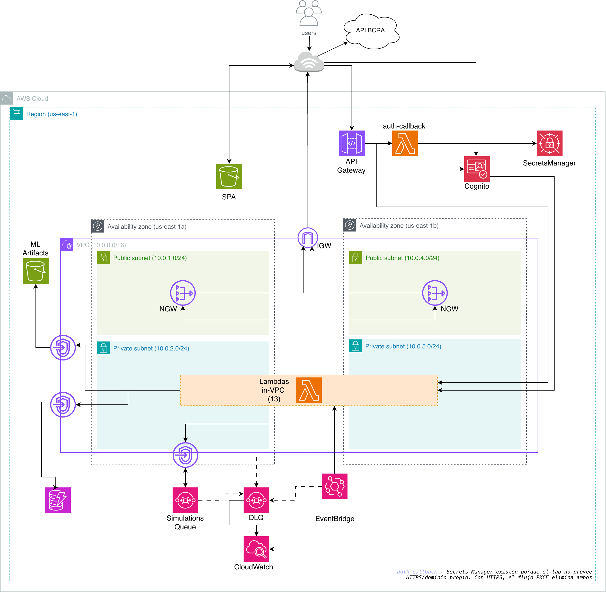

# Presti - Cloud Computing

El presente trabajo, realizado para la materia *Cloud Computing*, consiste en el desarrollo una motor de decisiones para Fintechs que busca mejorar el otorgamiento de productos crediticios (préstamos) a sus clientes minoritas. Para esto, se desarrolló una plataforma cloud que contiene un motor de machine learning que consulta los datos históricos de la *Central de Deudores del BCRA* y predice la situación creditica por los próximos meses.

La plataforma cuenta principalmente con las siguientes funcionalidades representadas en su panel de control:

- <b>Carga y Gestión de Productos</b>: Panel administrativo para que la Fintech gestione de forma directa su catálogo de ofertas financieras (préstmos de distintos montos, plazos, etc.) y les asigne prioridades según sus preferencias comerciales.

- <b>Motor de Simulaciones</b>: Módulo para calcular en tiempo real el scoring de nuevos clientes ingresando su CUIT. Consulta información del BCRA, evalúa al deudor a través de un modelo de Deep Learning (MLP con TensorFlow/Keras) y ofrece recomendaciones inteligentes e instantáneas de productos elegibles.

- <b>Configuración de Parámetros</b>: Sección dedicada a definir los parámetros y reglas globales del negocio de la Fintech (como los umbrales de score mínimo y criterios generales de exclusión) para filtrar automáticamente a solicitantes de alto riesgo.

- <b>Control de Cartera</b>: Monitoreo continuo y centralizado del estado crediticio e historial de deudas de los CUITs en cartera. Permite visualizar tendencias de comportamiento de pagos (mejorando, empeorando o estable) y soporta tanto actualizaciones manuales como automáticas programadas (mediante crons mensuales).

<details>
  <summary>Contenidos</summary>
  <ol>
    <li><a href="#diagrama-de-arquitectura">Diagrama de Arquitectura</a></li>
    <li><a href="#estructura-del-repositorio">Estructura del Repositorio</a></li>
    <li><a href="#uso-de-la-aplicación-guía-de-ejecución">Uso de la Aplicación (Guía de Ejecución)</a></li>
    <li><a href="#descripción-de-módulos">Descripción de Módulos</a></li>
    <li><a href="#explicación-de-funciones-y-meta-argumentos">Explicación de Funciones y Meta-Argumentos</a></li>
    <li><a href="#pipeline-de-github-actions-para-terraform">Pipeline de GitHub Actions (Terraform)</a></li>
    <li><a href="#aclaraciones">Aclaraciones</a></li>
    <li><a href="#integrantes">Integrantes</a></li>
  </ol>
</details>

<p align="right">(<a href="#presti---cloud-computing">Volver</a>)</p>

## Diagrama de Arquitectura



<p align="right">(<a href="#presti---cloud-computing">Volver</a>)</p>

## Estructura del Repositorio:

```
cloud-presti/
├── frontend/               # SPA React + Vite (dashboard fintech)
├── engine/                 # Pipeline Python de training del modelo crediticio
├── backend/                # 14 Lambdas — Node.js (13) + Python (simulations-engine)
├── terraform/              # Stack principal de infra (root module)
│   └── modules/
│       └── network/        # Módulo interno de VPC + subnets + RTs + SGs + endpoints
├── terraform-bootstrap/    # Stack independiente para el state remoto (run una vez)
├── scripts/                # Helpers: bootstrap, deploy, build-engine, build-frontend...
└── .github/
    └── workflows/          # CI (validate) + apply / destroy / bootstrap manuales
```

<p align="right">(<a href="#presti---cloud-computing">Volver</a>)</p>

## Uso de la Aplicación (Guía de Ejecución)

A continuación se detalla la arquitectura de negocio y la guía de ejecución técnica paso a paso para el ciclo completo de la plataforma:

### 1. Registro y Autenticación
1. **Acceso al Portal**: El administrador de la Fintech accede a la plataforma (`website_endpoint`). Al seleccionar **Crear cuenta**, es redirigido a la **Cognito Hosted UI** administrada en AWS.
2. **Registro e Inserción Automática (Post-Confirmation Trigger)**: Tras ingresar los datos bajo políticas estrictas de seguridad (mayúsculas, minúsculas, números, caracteres mínimos), Cognito envía un código OTP de confirmación al e-mail registrado. Al ingresarse este código y verificarse el usuario, se ejecuta el trigger asíncrono `fintech-post-confirmation` (Lambda Node.js). Éste inserta automáticamente el registro base de la Fintech en la tabla `fintech` con configuraciones por defecto (`max_situacion_crediticia = 2`, `max_entidades_con_deuda = 3`, etc.) para asegurar el aprovisionamiento inmediato.
3. **Canje de Tokens e Interacción de Red (VPC Isolation Boundary)**: Al finalizar el registro, Cognito redirige al navegador de vuelta a la API Gateway (`GET /callback`), invocando la Lambda `auth-callback` (Node.js). Esta Lambda **se ejecuta en el espacio público (fuera de la VPC)** para poder comunicarse libremente y sin sobrecostos de NAT Gateways con los endpoints públicos de Cognito y el servicio Secrets Manager. Recupera el *client secret* del Secrets Manager (`${var.stack_name}/cognito/client-secret`), canjea el código por tokens JWT (Access, ID, Refresh) y redirige al frontend con los mismos.

### 2. Configuración de Reglas y Parámetros de Negocio
Desde el panel de control, la Fintech puede editar sus reglas de admisión globales (`PUT /fintech`), las cuales se persisten en la tabla `fintech`.
* **Atributos de Negocio en DynamoDB**:
  * `max_situacion_crediticia` (N): Límite superior de la situación permitida en BCRA (ej. 2).
  * `max_entidades_con_deuda` (N): Cantidad máxima de entidades financieras que pueden reportar deuda simultáneamente (ej. 3).
  * `max_deuda_total_ars` (N): Monto acumulado de deuda en ARS permitido (ej. 350,000 ARS).
  * `min_meses_situacion_1` (N): Racha mínima exigida de meses consecutivos en situación normal 1 en el historial (ej. 6).
  * `max_dias_atraso` (N): Días de retraso máximos tolerados en pagos (ej. 30).
  * `permite_proceso_judicial` (BOOL): Flag de exclusión que, de ser falso, rechaza automáticamente a deudores con litigios o cobros judiciales en curso.
* **Resiliencia de Carga**: Si la lectura de parámetros a nivel Lambda falla, se reintenta hasta 3 veces con *exponential backoff*. Si el ítem no existe o faltan campos individuales, el motor aplica de forma automática la colección `FINTECH_DEFAULTS` para salvaguardar la ejecución de la simulación.

### 3. Alta y Catálogo de Productos Financieros
Antes de simular, la Fintech define sus ofertas financieras en **Productos → Nuevo producto** (llamando a `POST /product`).
* Cada producto se registra en la tabla `product` con clave compuesta `sub` (Hash, ID de la Fintech) y `product_id` (Range, UUID v4). Contiene:
  * **Metadatos comerciales**: Nombre, Monto, Cantidad de Cuotas, Tasa de Interés y Prioridad (escala 1 a 10).
  * **Parámetros de admisibilidad**: `min_score` y `max_score` definidos en una escala de `[0.0, 10.0]`. El motor los contrastará con el scoring del solicitante para sugerir la oferta comercial.

### 4. Ciclo de Ejecución de la Simulación y Motor de Inteligencia Artificial (ML)
Al ingresar el CUIT de un cliente en **Nueva simulación**, se inicia un flujo reactivo asíncrono de alto rendimiento:
1. **API Gateway (`POST /simulations`)**: Valida el JWT y delega el flujo a la Lambda `simulations-handler` dentro de la VPC.
2. **Transacción Atómica (`TransactWriteItemsCommand`)**: Para garantizar consistencia relacional absoluta sin colisiones de carrera, la Lambda realiza exactamente **4 operaciones de escritura en una única transacción** sobre DynamoDB:
   * **`Put` en `dynamodb_user`**: Vincula de forma permanente el CUIT consultado a la Fintech (`sub`).
   * **`Update` en `dynamodb_portfolio`** (Clave `{pk: CUIT#<cuit>, sk: INFO}`): Siembra/inicializa el estado del deudor si es nuevo, asignándole `current_status = "1"`, `previous_status = "1"`, `trend = "stable"`, `last_updated = timestamp`, y `record_type = "INFO"`. Utiliza expresiones `if_not_exists` para no pisar datos históricos si el CUIT ya era trackeado por otra Fintech.
   * **`Put` en `dynamodb_portfolio`** (Clave `{pk: CUIT#<cuit>, sk: FINTECH#<sub>}`): Registra la relación de seguimiento del deudor por parte de esta Fintech específica, configurando el GSI principal `gsi1` (`gsi1_pk = FINTECH#<sub>`, `gsi1_sk = CUIT#<cuit>`).
   * **`Put` en `dynamodb_simulations`** (Clave `{sub: <sub>, sk: CUIT#<cuit>#TASK#<task_id>}`): Crea el registro inicial de la simulación marcándolo con `status = "PROCESSING"`.
3. **Encolamiento en SQS**: Una vez comprometida la transacción en DynamoDB, la Lambda publica un mensaje en la cola SQS (`simulations-queue`) que contiene `{ task_id, cuit, sub, timestamp }` y devuelve de forma instantánea un `202 Accepted` al frontend con el `task_id` correspondiente.
4. **Motor de Inferencia (`simulations-engine`)**:
   * Esta Lambda (desarrollada en **Python 3.12** e integrada nativamente a SQS con un tamaño de lote de 1) es el núcleo inteligente.
   * **Ciclo de Vida de los Artefactos ML**: A nivel de *Cold Start*, descarga de manera segura desde el bucket privado encriptado `${stack_name}-model-artifacts` los 4 componentes clave del modelo bajo el prefijo `v1/` y los almacena en memoria volátil local (`/tmp/artifacts`):
     1. `modelo_crediticio.tflite` (Red Neuronal Multicapa - MLP en formato TensorFlow Lite).
     2. `scaler_params.json` (Parámetros estadísticos de media y desviación estándar de entrenamiento).
     3. `feature_columns.json` (Esquema de columnas e inputs requeridos por la red).
     4. `feature_fill_values.json` (Valores de imputación para registros huérfanos).
   * **Extracción de Variables (Feature Derivation)**: Invoca la API pública del BCRA (`https://api.bcra.gob.ar/centraldedeudores/v1.0/Deudas/Historicas/{cuit}`). A partir del payload JSON de respuesta, deriva dinámicamente un vector matemático compuesto por **20 features específicas**:
     * *Variables Mensuales (10)*: `situacion` (situación deudora máxima del mes en curso), `prestamos_total` (monto total de deuda acumulada en miles de pesos), `dias_atraso_max` (días de atraso máximos registrados), `tiene_garantia_a` (default 0), `ratio_cobertura` (default 0.0), `refinanciado` (0 o 1 si posee refinanciaciones activas), `proceso_judicial` (0 o 1 si está en juicio), `recategorizado` (0 o 1 si posee recategorizaciones obligadas), `irrecuperable` (0 o 1 por disposición técnica), `cant_entidades` (total de acreedores).
     * *Variables Históricas (10)*: `meses_en_sit1` (meses en situación normal 1 en los últimos 24 meses), `meses_sit_mala` (meses con situación >= 3), `peor_situacion_24m` (máxima situación registrada en el período de seguimiento), `tendencia_situacion` (pendiente lineal que contrasta el promedio de los últimos 3 meses contra los 9 meses previos), `racha_sit1_actual` (meses seguidos en situación 1 en la ventana histórica), `variacion_monto_12m` (ratio de crecimiento o decrecimiento interanual de la deuda), `monto_promedio_24m`, `monto_max_24m`, `meses_con_deuda` (conteo de meses con saldo activo), y `actividad` (categoría comercial, default 'desconocido').
   * **Filtros de Exclusión Avanzados**: Evalúa si el perfil del solicitante colisiona con los parámetros definidos por la Fintech. Si se incumple alguna regla, detiene la inferencia, registra las causas exactas y actualiza el estado de la simulación a `REJECTED` en DynamoDB.
   * **Inferencia en LiteRT / TFLite**: Si pasa los filtros, inicializa el intérprete de TFLite (`ai_edge_litert`), escala el vector de inputs según la fórmula `scaled_val = (val - mean) / scale` del Scaler de entrenamiento, alimenta la red neuronal y extrae un scoring continuo en el rango de `[0.0, 1.0]`. Actualiza el registro en la DB a `COMPLETED` inyectando el `score`.
   * **Esquema de Reintentos Progresivos de SQS**: En caso de errores transitorios en la consulta externa al BCRA, el motor captura el error y realiza un **re-encolamiento progresivo a nivel de aplicación** en SQS incrementando el contador de intentos. Los retrasos entre reintentos se rigen por la secuencia `RETRY_DELAYS = [60, 120, 240, 480]` segundos. Si se agotan los 4 reintentos, el estado en DynamoDB se marca formalmente como `FAILED`. La SQS DLQ (`simulations-queue-dlq`) actúa como resguardo final de infraestructura de AWS ante pérdidas de red catastróficas.

* **Los Cinco Estados de una Simulación**:
  | Estado | Disparador y Significado |
  | :--- | :--- |
  | `PROCESSING` | CUIT encolado en SQS, esperando ejecución del motor de inferencia. |
  | `COMPLETED` | Inferencia exitosa. Contiene el scoring continuo `score` en el rango `[0.0, 1.0]`. |
  | `REJECTED` | El deudor no cumple con los filtros y umbrales mínimos del negocio. Almacena en `rejection_reasons` la lista de reglas violadas. |
  | `NO_DATA` | Se activa ante una excepción no recuperable del tipo `NoRetryError` (ej. CUIT inexistente en BCRA con HTTP 404, o historial financiero con menos de 7 períodos mínimos). Evita reintentos inútiles y protege la API. |
  | `FAILED` | Errores de infraestructura no controlados (ej. blips graves de red del BCRA o caídas de AWS). Almacena el `error_message`. |

### 5. Resolución e Inteligencia de Recomendaciones
Una vez que la simulación cambia a `COMPLETED`, el frontend invoca `GET /recommendations?task_id=<id>`.
1. **Optimización de Lectura**: La Lambda `recommendations-get` consulta de manera extremadamente eficiente la tabla `simulations` utilizando el índice **GSI `task-id-sub-index`** (`task_id` de hash y `sub` de range). Esto garantiza el aislamiento multi-inquilino de las Fintechs y evita la lectura de registros pertenecientes a otros clientes.
2. **Escalabilidad de Scoring**: Multiplica el score obtenido del motor (`[0.0, 1.0]`) por 10, mapeándolo a la escala continua de `[0.0, 10.0]`.
3. **Clasificación y Reglas de Desempate (Ranking)**:
   * Contrasta el score final x10 con los límites `[min_score, max_score]` de los productos vigentes de la Fintech.
   * **Elegibles**: Aquellos productos cuyos rangos contienen el score del deudor. Se ordenan de forma descendente por prioridad comercial (`priority DESC`). **Ante empates de prioridad comercial, se resuelve de manera alfabética ascendente utilizando el nombre del producto (`localeCompare`)**, logrando un comportamiento predecible y uniforme.
   * **No Elegibles**: Aquellos fuera del rango del score. El backend estructura y devuelve la razón técnica de la exclusión (ej. *"Score X por debajo del mínimo Y"* o *"Score X por encima del máximo Y"*).

### 6. Monitoreo de Cartera (Portfolio) y Control de Duplicación
* **Visualización Eficiente (`GET /portfolio`)**: La Lambda `portfolio-get` recupera los clientes trackeados utilizando la clave inversa en el **GSI `gsi1`** de la tabla `portfolio` (`gsi1_pk = FINTECH#<sub>`), permitiendo paginación nativa y lecturas a bajo costo.
* **Módulo de Actualización del Portfolio (`portfolio-updater`)**:
  * Se ejecuta de manera programada mediante una regla de EventBridge (`cron(0 10 1 * ? *)`) el día 1 de cada mes o mediante invocación manual (`POST /portfolio/refresh`).
  * **Optimización de Iteración (Sparse GSI)**: Consulta el índice sparse `record-type-pk-index` buscando la clave `record_type = "INFO"`. Dado que es sparse, DynamoDB solo indexa los ítems que contienen este atributo (los registros base de datos de los CUITs), omitiendo todos los registros de relación Fintech-CUIT. Esto permite iterar la cartera global a una fracción minúscula del costo, erradicando los `Scan` globales.
  * **Control Anti-Duplicación de Consultas al BCRA**: Cada vez que se evalúa un CUIT, la Lambda compara el campo `last_processed_period` contra el período actual en formato `YYYY-MM`. Si ya coincide, **omite la consulta para evitar consumir de forma duplicada la API externa del BCRA** durante el mismo mes.
  * **Manejo de Situaciones y Derivación de Tendencia**:
    * Si el BCRA devuelve HTTP 404 (sin datos), marca `last_processed_period = currentPeriod` para saltear futuros intentos en el mes, pero mantiene intacto el estado crediticio histórico almacenado.
    * En caso de contar con datos, extrae la máxima situación crediticia del período más reciente (situación del mes 0 entre 1 y 6).
    * Compara esta situación con la previa (`current_status` actual, por defecto "1").
    * Calcula la **Tendencia (Trend)**:
      * Si la nueva situación es numérica mayor que la previa -> `trend = "down"` (el deudor empeoró su estado).
      * Si la nueva situación es numérica menor que la previa -> `trend = "up"` (el deudor mejoró su comportamiento).
      * Si son iguales -> `trend = "stable"`.
    * Si ocurre un cambio de estado, actualiza de manera transaccional `current_status`, `previous_status`, `trend` y `last_updated`. En cualquier caso de éxito o 404, actualiza `last_processed_period` al mes en curso.

<p align="right">(<a href="#presti---cloud-computing">Volver</a>)</p>

## Descripción de Módulos

El proyecto se estructura bajo un enfoque modular, limpio y escalable con las siguientes definiciones de infraestructura en Terraform:

### 1. Módulo Raíz (`terraform/`)
Es el punto de entrada y composición arquitectónica del proyecto. Orquesta y compone la infraestructura global:
* Declara la red mediante la invocación del módulo local `network`.
* Configura los recursos del Core de AWS: 5 tablas de DynamoDB (a través del módulo del registry oficial), la cola SQS principal y su DLQ, las 14 Lambdas del backend, la API HTTP de API Gateway, el User Pool de Cognito, Secrets Manager para el resguardo seguro del client secret, y el S3 que sirve el frontend estático.
* Centraliza en `locals.tf` todos los diccionarios y colecciones (`lambda_sources`, `lambda_configs`, `lambda_permissions`, `api_integrations`, `api_routes`) para alimentar los recursos iterativamente, reduciendo la duplicación y el hardcoding.
* **Bucket de Artefactos de ML (`model-artifacts`)**: Un bucket privado S3 (`${var.stack_name}-model-artifacts`) con versionado habilitado, cifrado por defecto AES256, políticas `BucketOwnerEnforced` y bloqueo de acceso público estricto. Aloja los artefactos v1 del modelo neuronal (`modelo_crediticio.tflite`, `scaler_params.json`, `feature_columns.json`, `feature_fill_values.json`) consumidos por las Lambdas de inferencia.
* **Alarmas de CloudWatch (`alarms.tf`)**:
  * **Alarma de cola muerta (`dlq_messages_visible`)**: Monitorea si hay mensajes en la DLQ (`simulations-queue-dlq`) mediante la métrica `ApproximateNumberOfMessagesVisible` superior a 0 en ventanas de 5 minutos, indicando fallas persistentes de infraestructura en las simulaciones.
  * **Alarmas de Lambdas críticas (`lambda_errors`)**: Crea alarmas de error dinámicas usando `for_each` sobre las 4 funciones más críticas (`simulations-engine`, `simulations-handler`, `fintech-post-confirmation` y `portfolio-updater`). Reportan si la métrica de `Errors` es mayor a 0 en cualquier período de 5 minutos.

### 2. Módulo Interno de Red (`terraform/modules/network/`)
Módulo local reutilizable que encapsula el aprovisionamiento de la VPC y el plano de red seguro:
* **Entradas Declarativas**: Recibe configuraciones en variables de tipo objeto (`vpc_config`, `subnets_config`, `route_tables_config`, `security_groups_config`, `vpc_endpoints_config`).
* **Aislamiento y Topografía**: Crea subnets públicas (para NAT Gateways e Internet Gateway) y privadas. Las 13 Lambdas del Core de negocio se despliegan strictly in-VPC en subnets privadas, garantizando que estén aisladas de la red pública. La única excepción es `auth-callback`, que reside en el espacio público de AWS para interactuar de forma ágil con Cognito y Secrets Manager.
* **Seguridad y Endpoints**: Implementa Security Groups con soporte para referencias cruzadas (por ejemplo, permitir tráfico únicamente del Security Group de Lambdas hacia los VPC Interface Endpoints).
* **VPC Endpoints**: Crea 3 endpoints para mantener el tráfico de red interno en la red troncal de AWS:
  * **Gateway Endpoint para DynamoDB**: Asociado a las tablas de ruteo privadas.
  * **Gateway Endpoint para S3**: Asociado a las tablas de ruteo privadas (usado para la descarga del modelo crediticio).
  * **Interface Endpoint para SQS (Private Link)**: Utiliza subnets privadas y asocia un Security Group exclusivo (`interface-endpoints-sg`) que restringe el acceso de puertos HTTPS únicamente al Security Group de las Lambdas (`lambda-sg`).

### 3. Módulo Público de DynamoDB (`terraform-aws-modules/dynamodb-table/aws` v4.4.0)
Módulo del registry oficial instanciado **5 veces** para proveer persistencia aislada a nivel de tabla bajo demanda (`billing_mode = PAY_PER_REQUEST`):
1. **`dynamodb_simulations`** (`${stack_name}-simulations`):
   * Hash key: `sub` | Range key: `sk`.
   * **GSI `task-id-sub-index`**: Indexa `task_id` (Hash) y `sub` (Range). Permite a `recommendations-get` y `simulations-results` buscar directamente por el ID de la tarea de forma sumamente rápida, garantizando aislamiento multi-inquilino.
2. **`dynamodb_fintech`** (`${stack_name}-fintech`):
   * Hash key: `sub` (parámetros globales de la Fintech).
3. **`dynamodb_product`** (`${stack_name}-product`):
   * Hash key: `sub` | Range key: `product_id` (catálogo de créditos de la Fintech).
4. **`dynamodb_user`** (`${stack_name}-user`):
   * Hash key: `sub` | Range key: `cuit` (vínculo entre Fintech y CUITs consultados).
5. **`dynamodb_portfolio`** (`${stack_name}-portfolio`):
   * Hash key: `pk` | Range key: `sk`.
   * **GSI `gsi1`**: Indexa `gsi1_pk` y `gsi1_sk` para la resolución inversa Fintech -> CUIT.
   * **Sparse GSI `record-type-pk-index`**: Indexa `record_type` (Hash) y `pk` (Range). Al ser sparse, solo almacena ítems del tipo `INFO`, lo que permite al actualizador mensual iterar únicamente los CUITs de forma ágil y barata sin incurrir en `Scan` globales costosos sobre registros de control.

### 4. Stack de Bootstrap (`terraform-bootstrap/`)
Un stack independiente y aislado cuyo único objetivo es la creación de los recursos de soporte para la ejecución remota de Terraform:
* Un bucket S3 con encriptación AES256, versionado activo y bloqueo estricto de acceso público para almacenar el backend state de Terraform de forma segura.
* Una tabla de DynamoDB para el control de concurrencia y bloqueo de estado (`LockTable`), previniendo colisiones en despliegues concurrentes.

<p align="right">(<a href="#presti---cloud-computing">Volver</a>)</p>

## Explicación de Funciones y Meta-Argumentos

El diseño de la infraestructura en Terraform utiliza avanzadas metodologías de programación declarativa y validaciones rigurosas:

### 1. Meta-Argumentos Utilizados
* **`for_each`**: Es el motor de la iteración. Evita la duplicación masiva de código instanciando múltiples recursos dinámicamente. Se utiliza para:
  * Las 13 Lambdas del Core y sus configuraciones detalladas.
  * Los 14 grupos de logs en CloudWatch (asegurando el ciclo de vida coordinado con cada función).
  * Los permisos de invocación y mapeo de triggers.
  * La creación modular de las 5 tablas DynamoDB.
  * La definición de subnets, tablas de ruteo, reglas de seguridad y endpoints en el módulo `network`.
  * La asignación de alarmas de CloudWatch para métricas de error.
* **`dynamic`**: Utilizado para inyectar bloques configurativos anidados condicionalmente. En `aws_lambda_function.lambdas`, se aplica en:
  * `vpc_config`: Inyecta la red únicamente a las Lambdas que tienen configurado `in_vpc = true`.
  * `dead_letter_config`: Asocia la DLQ solo a aquellas Lambdas asíncronas registradas para opt-in en `local.lambda_async_dlq_arns`.
* **`lifecycle` y `precondition`**: Bloques para definir políticas de ciclo de vida e invariantes de negocio/arquitectura que detienen tempranamente la ejecución antes de causar inconsistencias en AWS:
  * **En `aws_route`**: Valida que si una ruta apunta a un target `nat`, la tabla de ruteo solo contenga subnets de una única Zona de Disponibilidad (AZ) y que exista un NAT Gateway aprovisionado en dicha AZ.
  * **En `aws_vpc_endpoint`**: Exige que el tipo sea "Gateway" o "Interface", validando que los endpoints Gateway tengan tablas de ruteo asociadas y que los endpoints Interface tengan subnets asociadas.
* **`depends_on`**: Declara dependencias de orden explícitas. Garantiza que los `aws_cloudwatch_log_group.lambdas` se creen estrictamente antes que las `aws_lambda_function` (previniendo que las Lambdas auto-generen grupos sin retención que hinchen el presupuesto), y que el build del frontend (`terraform_data.build_frontend`) comience recién cuando Cognito, la API y S3 estén listos.
* **`provider`**: Permite definir múltiples configuraciones. Se utiliza a nivel root con el bloque `default_tags` para propagar automáticamente tags globales (`Project`, `Environment`, `ManagedBy`, `Repository`) a todo recurso que soporte etiquetado en AWS.

### 2. Funciones de Terraform Empleadas
* **`flatten()`**: Aplana listas anidadas de objetos en una colección lineal. Esencial para iterar colecciones complejas como la de permisos de Lambdas (`local.lambda_permissions`) o las reglas complejas de ruteo y security groups en el módulo de red.
* **`for ... in ...`**: Comprensión sintáctica para construir mapas y listas filtradas o transformadas en tiempo real. Por ejemplo: `[for cidr in var.private_subnet_cidrs : module.vpc.subnet_ids[cidr]]` para mapear los rangos CIDR a IDs de subnets reales provistos por el módulo de red.
* **`concat()`**: Combina múltiples listas en una sola. Usado para agrupar el set de Lambdas regulares y la Lambda especial `auth-callback` en una lista consolidada para los CloudWatch Log Groups.
* **`lookup()`**: Busca una clave en un mapa de forma segura, retornando un valor por defecto si no existe (por ejemplo, resolver los DLQ ARNs opt-in sin arrojar errores de referencia nula).
* **`jsonencode()`**: Serializa objetos y estructuras de datos nativas de Terraform a strings JSON válidos. Usado para empaquetar la bucket policy del frontend de S3 y el `redrive_policy` de la cola SQS.
* **`filemd5()`**: Calcula el hash MD5 del script de despliegue del frontend, utilizándolo dentro de los triggers de reemplazo en `terraform_data` para forzar un rebuild automático y sincronización a S3 solo cuando el script o configuraciones clave varían.
* **`length()`, `contains()`, `keys()`, `distinct()`, `toset()`**: Utilidades nativas de manipulación y validación de colecciones para verificar condiciones de ruteo y saneamiento de variables.

### 3. Otros Recursos Destacados
* **`data "archive_file"`**: Empaqueta el código de cada Lambda en archivos ZIP al vuelo durante el ciclo del plan/apply. El cálculo nativo de su `source_code_hash` permite que Terraform detecte cambios en el código de NodeJS/Python y redespliegue únicamente las Lambdas modificadas.
* **`data "aws_iam_role"`**: Referencia y consume el rol preexistente `LabRole` provisto por AWS Academy, necesario por las severas restricciones del entorno educativo.
* **`aws_cloudwatch_log_group`**: Declara explícitamente los grupos de logs para configurar una retención estricta de 7 días, previniendo costos descontrolados por retención indefinida (default de AWS).

<p align="right">(<a href="#presti---cloud-computing">Volver</a>)</p>

## Pipeline de GitHub Actions (Terraform)

El proyecto cuenta con un esquema de Integración Continua (CI) robusto que automatiza las tareas de aseguramiento de calidad del código de infraestructura en cada cambio.

### 1. Validación de Infraestructura en CI (`ci.yml`)
Cada vez que se sube código o se genera un Pull Request, se ejecuta el workflow de validación. Este workflow realiza pruebas de sintaxis, formato y coherencia arquitectónica **sin inicializar recursos en AWS (`-backend=false`)** para actuar de forma sumamente rápida:

```yaml
jobs:
  terraform:
    name: Terraform
    runs-on: ubuntu-latest

    steps:
      - name: Checkout
        uses: actions/checkout@v4

      - name: Setup Terraform
        uses: hashicorp/setup-terraform@v3
        with:
          terraform_version: "~1.9"
          terraform_wrapper: false

      - name: Terraform Init
        run: terraform init -backend=false
        working-directory: terraform

      - name: Terraform Format Check
        run: terraform fmt -check -recursive
        working-directory: terraform
        continue-on-error: true

      - name: Terraform Validate
        run: terraform validate
        working-directory: terraform
```

El mismo job se ejecuta en paralelo para el stack de **bootstrap** (`terraform-bootstrap/`) y para el módulo aislado de **red** (`terraform/modules/network/`), garantizando que cualquier error de sintaxis o rotura interna de variables en el módulo modularizado sea detectado de inmediato.

### 2. Pipeline de Despliegue con Plan Guardado (`terraform-apply.yml`)
Para los despliegues formales en la rama principal (`main`), el pipeline de ejecución remota de Terraform implementa las mejores prácticas de infraestructura como código (IaC):
1. **Inicialización (`terraform init`)**: Se conecta al backend de S3 remoto configurando los locks en DynamoDB.
2. **Validación y Chequeo de Formato (`validate` y `fmt`)**: Valida la integridad del código.
3. **Plan Guardado (`terraform plan -out=tfplan`)**: Genera el plan de ejecución y lo persiste en un archivo físico binario (`tfplan`). Esto garantiza que los cambios planificados y auditados sean **exactamente los mismos** que se aplicarán en el paso posterior, mitigando problemas por drifts de estado de último segundo.
4. **Aplicación del Plan (`terraform apply tfplan`)**: Ejecuta los cambios de manera directa y predecible.

```yaml
      - name: Terraform Init
        run: bash scripts/terraform-init.sh

      - name: Terraform Format Check
        run: terraform fmt -check -recursive
        working-directory: terraform
        continue-on-error: true

      - name: Terraform Validate
        run: terraform validate
        working-directory: terraform

      - name: Terraform Plan
        run: terraform plan -no-color -out=tfplan
        working-directory: terraform

      - name: Terraform Apply
        if: github.ref == 'refs/heads/main'
        run: terraform apply tfplan
        working-directory: terraform
```

<p align="right">(<a href="#presti---cloud-computing">Volver</a>)</p>

## Aclaraciones

Algunas aclaraciones finales con respecto a las funcionalidades y robustez de este trabajo:
* <b>Resolución de Recomendaciones</b>: La asignación y ranking de ofertas financieras elegibles y no elegibles se procesa de forma integral y determinista en el backend a través del endpoint `GET /recommendations` (Lambda `recommendations-get`), garantizando que la lógica de negocio esté centralizada en la nube y que el frontend reciba directamente la clasificación de admisibilidad y orden comercial.
* <b>API BCRA</b>: La funcionalidad de la API provista por el BCRA no es consistente, algunas veces las request logran llegar a destino y se obtiene una respuesta, pero otras no. Se intentó de distintas formas y con distintos headers, y se dejó de forma definitiva la configuración que mejores resultados arrójo.
* <b>Resiliencia ante Caídas del BCRA</b>: Dado que el BCRA es una API gubernamental externa sujeta a intermitencias breves, el motor inteligente de scoring implementa reintentos progresivos a nivel de aplicación con retrasos de 1, 2, 4 y 8 minutos (`RETRY_DELAYS`) para asegurar una alta tasa de éxito final sin degradar la experiencia de usuario.
* <b>Funcionalidad como API para Fintechs</b>: El sistema está diseñado modularmente como una colección de microservicios RESTful expuestos bajo autorización JWT, permitiendo una integración transparente no solo desde nuestro SPA de React, sino también directamente desde sistemas backend de terceros.

<p align="right">(<a href="#presti---cloud-computing">Volver</a>)</p>

## Integrantes:

Barnatán, Martín Alejandro (64463) - mbarnatan@itba.edu.ar

Gonzalez Cornet, Josefina (64550) - jgonzalezcornet@itba.edu.ar

Hillar, Conrado (64633) - chillar@itba.edu.ar

Maruottolo Quiroga, Ignacio Martín (64611) - imaruottoloquiroga@itba.edu.ar

Ignacio Pedemonte Berthoud (64908) - ipedemonteberthoud@itba.edu.ar

Thomas, Philippe (69250) - phthomas@itba.edu.ar

<p align="right">(<a href="#presti---cloud-computing">Volver</a>)</p>